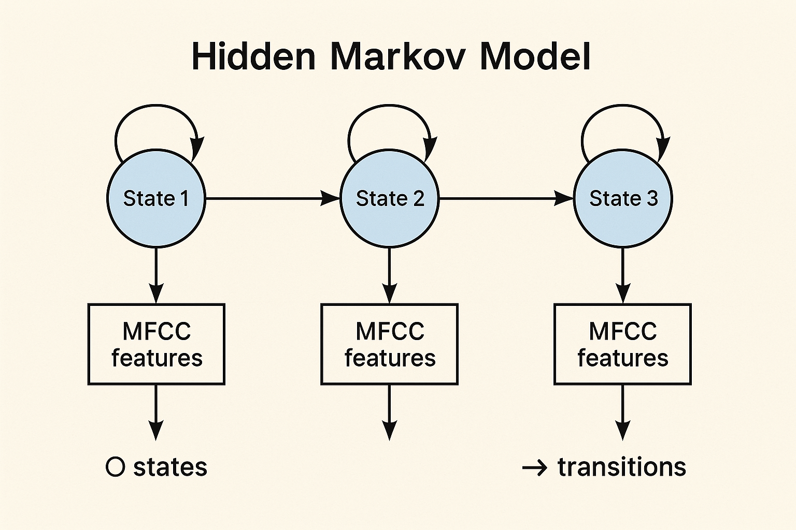

# Speech Emotion & Vocal‑Channel Recognition

A Python toolkit for training and evaluating **Hidden Markov Models** (HMMs) on speech data to perform:

- **Emotion Recognition** (neutral, calm, happy, sad, angry, fearful, disgust, surprised)  
- **Vocal‑Channel Classification** (speech vs. song)

This package provides end‑to‑end data download, parsing, preprocessing, feature extraction, model training and evaluation via a single CLI entrypoint `ser`.

---
## HMM Architecture

Below is a schematic of the hidden Markov model: each circle is a hidden state, arrows are transition probabilities, and the rectangular boxes are MFCC‐based observations emitted by each state.



## Installation

1. **Clone the repository**  
   ```bash
   git clone https://github.com/your‑org/speech_emotion_recognition.git
   cd speech_emotion_recognition
   ```

2. **Create & activate a virtual environment**  
   ```bash
   python3 -m venv .venv
   source .venv/bin/activate
   ```

3. **Install dependencies in editable mode**  
   ```bash
   pip install --upgrade pip setuptools wheel
   pip install -e .
   ```

---

## Configuration

All paths, URLs, and hyperparameters live in `config.toml` at the project root:

```toml
[paths]
raw_data_dir     = "data/Audio_Speech_Actors_01-24"
preproc_dir      = "data/preprocessed"
cleaned_csv      = "data/cleaned_data.csv"
models_dir       = "models"

[download]
url_song = "https://zenodo.org/records/1188976/files/Audio_Song_Actors_01-24.zip?download=1"
url_speech = "https://zenodo.org/records/1188976/files/Audio_Speech_Actors_01-24.zip?download=1"

[hmm]
n_states = 5
n_iter   = 30

[mfcc]
sr        = 16000
n_mfcc    = 13
frame_len = 0.025
hop_len   = 0.010
n_mels    = 40
```

Adjust any of these settings as needed.

---

## Usage

After installation, use the `ser` CLI:

```bash
ser --help
```

### 1. Download

Fetch and unzip the RAVDESS archives:

```bash
# Download both speech and song (default)
ser download

# Download only the speech dataset
ser download --type speech

# Download only the song dataset
ser download -t song
```

Files will be extracted under `paths.raw_data_dir`.

### 2. Preprocess

Parse filenames to metadata and preprocess audio:

```bash
ser preprocess
```

Outputs:

- `data/cleaned_data.csv`  
- `data/preprocessed/...` (16 kHz, pre‑emphasized, normalized WAVs)

### 3. Train

Train HMMs:

```bash
# Emotion models
ser train --mode emotion

# Vocal‑channel models (speech vs. song)
ser train --mode vocal
```

Saved under `models/emotion/` and `models/vocal/`.

### 4. Evaluate

Evaluate and display confusion matrices:

```bash
# Emotion recognition
ser eval --mode emotion

# Vocal‑channel
ser eval --mode vocal
```

---

## Methodology

1. **Filename Parsing**:  
   Extract metadata from RAVDESS filenames into `cleaned_data.csv`.

2. **Preprocessing**:  
   Mono‑mix, DC‑offset remove, pre‑emphasis, resample to 16 kHz, peak normalize.

3. **Feature Extraction**:  
   MFCCs (13) + delta + delta‑delta → stacked → CMVN.

4. **HMMs**:  
   - **Emotion**: stratified split by emotion  
   - **Vocal**: leave‑actors‑out split  

5. **Evaluation**:  
   Log‑likelihood scoring → confusion matrix & accuracy.

---

## Project Structure

```
speech_emotion_recognition/
├── setup.py
├── config.toml
├── src/
│   └── speech_emotion_recognition/
│       ├── __init__.py
│       ├── ser.py
│       ├── data_download.py
│       ├── data_parser.py
│       ├── feature_extraction.py
│       ├── train.py
│       └── evaluate.py
└── data/  (git‑ignored)
```

---

## Testing

```bash
pip install pytest
pytest
```

---